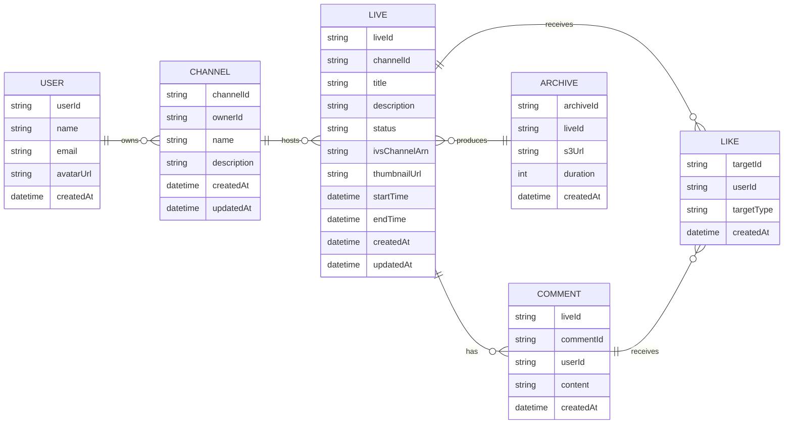

```mermaid
erDiagram

  direction LR

  USER ||--o{ CHANNEL : owns
  CHANNEL ||--o{ LIVE : hosts
  LIVE ||--o{ COMMENT : has
  LIVE }o--|| ARCHIVE : produces
  LIVE ||--o{ LIKE : receives
  COMMENT ||--o{ LIKE : receives

  USER {
    string userId
    string name
    string email
    string avatarUrl
    datetime createdAt
  }

  CHANNEL {
    string channelId
    string ownerId
    string name
    string description
    datetime createdAt
    datetime updatedAt
  }

  LIVE {
    string liveId
    string channelId
    string title
    string description
    string status
    string ivsChannelArn
    string thumbnailUrl
    datetime startTime
    datetime endTime
    datetime createdAt
    datetime updatedAt
  }

  COMMENT {
    string liveId
    string commentId
    string userId
    string content
    datetime createdAt
  }

  ARCHIVE {
    string archiveId
    string liveId
    string s3Url
    int duration
    datetime createdAt
  }

  LIKE {
    string targetId
    string userId
    string targetType
    datetime createdAt
  }

```