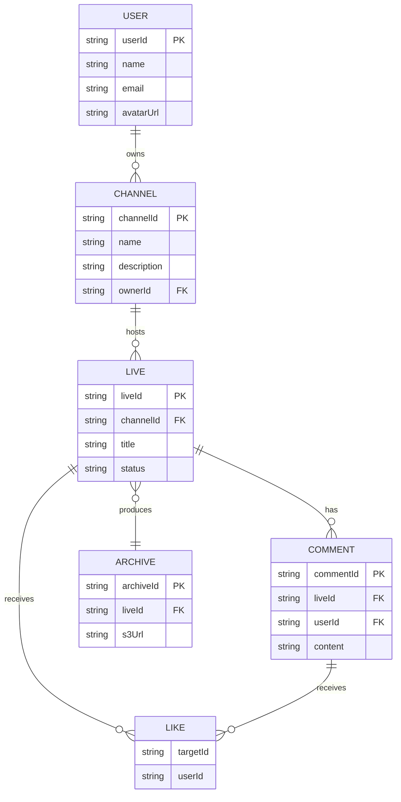

```mermaid
erDiagram
  USER ||--o{ CHANNEL : owns
  CHANNEL ||--o{ LIVE : hosts
  LIVE ||--o{ COMMENT : has
  LIVE }o--|| ARCHIVE : produces
  LIVE ||--o{ LIKE : receives
  COMMENT ||--o{ LIKE : receives

  USER {
    string userId PK
    string name
    string email
    string avatarUrl
  }

  CHANNEL {
    string channelId PK
    string name
    string description
    string ownerId FK
  }

  LIVE {
    string liveId PK
    string channelId FK
    string title
    string status
  }

  ARCHIVE {
    string archiveId PK
    string liveId FK
    string s3Url
  }

  COMMENT {
    string commentId PK
    string liveId FK
    string userId FK
    string content
  }

  LIKE {
    string targetId
    string userId
  }

```