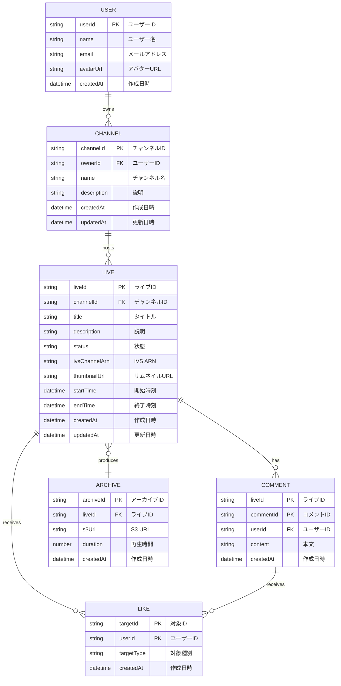

```mermaid
erDiagram

    USER {
        string userId PK "ユーザーID"
        string name "ユーザー名"
        string email "メールアドレス"
        string avatarUrl "アバターURL"
        datetime createdAt "作成日時"
    }

    CHANNEL {
        string channelId PK "チャンネルID"
        string ownerId FK "ユーザーID"
        string name "チャンネル名"
        string description "説明"
        datetime createdAt "作成日時"
        datetime updatedAt "更新日時"
    }

    LIVE {
        string liveId PK "ライブID"
        string channelId FK "チャンネルID"
        string title "タイトル"
        string description "説明"
        string status "状態"
        string ivsChannelArn "IVS ARN"
        string thumbnailUrl "サムネイルURL"
        datetime startTime "開始時刻"
        datetime endTime "終了時刻"
        datetime createdAt "作成日時"
        datetime updatedAt "更新日時"
    }

    COMMENT {
        string liveId PK "ライブID"
        string commentId PK "コメントID"
        string userId FK "ユーザーID"
        string content "本文"
        datetime createdAt "作成日時"
    }

    ARCHIVE {
        string archiveId PK "アーカイブID"
        string liveId FK "ライブID"
        string s3Url "S3 URL"
        number duration "再生時間"
        datetime createdAt "作成日時"
    }

    LIKE {
        string targetId PK "対象ID"
        string userId PK "ユーザーID"
        string targetType "対象種別"
        datetime createdAt "作成日時"
    }

    USER ||--o{ CHANNEL : owns
    CHANNEL ||--o{ LIVE : hosts
    LIVE ||--o{ COMMENT : has
    LIVE }o--|| ARCHIVE : produces
    LIVE ||--o{ LIKE : receives
    COMMENT ||--o{ LIKE : receives

```