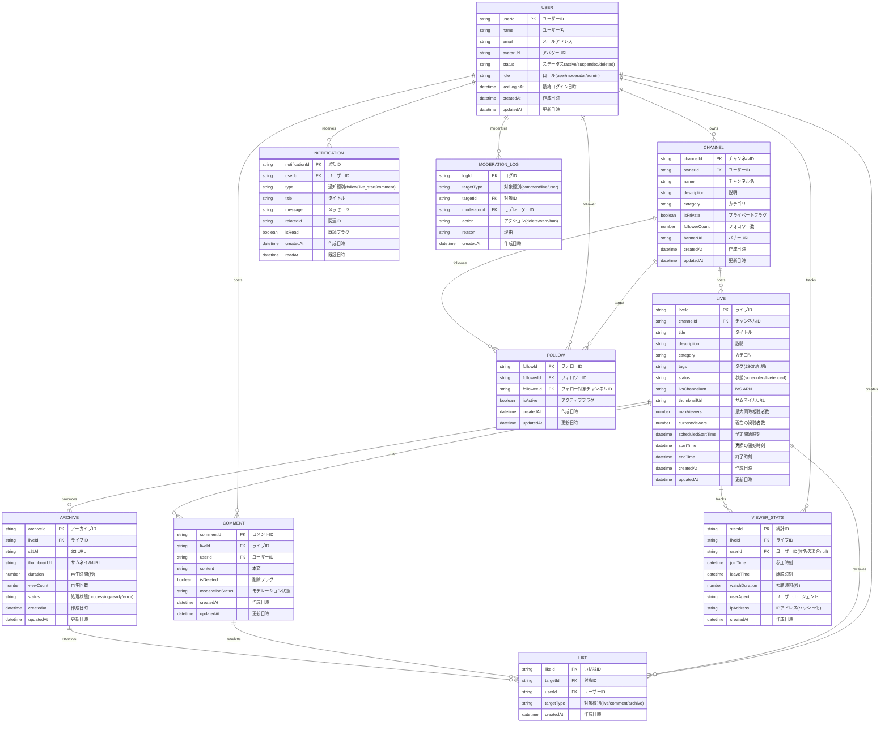

```mermaid
erDiagram

    USER {
        string userId PK "ユーザーID"
        string name "ユーザー名"
        string email "メールアドレス"
        string avatarUrl "アバターURL"
        string status "ステータス(active/suspended/deleted)"
        string role "ロール(user/moderator/admin)"
        datetime lastLoginAt "最終ログイン日時"
        datetime createdAt "作成日時"
        datetime updatedAt "更新日時"
    }

    CHANNEL {
        string channelId PK "チャンネルID"
        string ownerId FK "ユーザーID"
        string name "チャンネル名"
        string description "説明"
        string category "カテゴリ"
        boolean isPrivate "プライベートフラグ"
        number followerCount "フォロワー数"
        string bannerUrl "バナーURL"
        datetime createdAt "作成日時"
        datetime updatedAt "更新日時"
    }

    LIVE {
        string liveId PK "ライブID"
        string channelId FK "チャンネルID"
        string title "タイトル"
        string description "説明"
        string category "カテゴリ"
        string tags "タグ(JSON配列)"
        string status "状態(scheduled/live/ended)"
        string ivsChannelArn "IVS ARN"
        string thumbnailUrl "サムネイルURL"
        number maxViewers "最大同時視聴者数"
        number currentViewers "現在の視聴者数"
        datetime scheduledStartTime "予定開始時刻"
        datetime startTime "実際の開始時刻"
        datetime endTime "終了時刻"
        datetime createdAt "作成日時"
        datetime updatedAt "更新日時"
    }

    COMMENT {
        string commentId PK "コメントID"
        string liveId FK "ライブID"
        string userId FK "ユーザーID"
        string content "本文"
        boolean isDeleted "削除フラグ"
        string moderationStatus "モデレーション状態"
        datetime createdAt "作成日時"
        datetime updatedAt "更新日時"
    }

    ARCHIVE {
        string archiveId PK "アーカイブID"
        string liveId FK "ライブID"
        string s3Url "S3 URL"
        string thumbnailUrl "サムネイルURL"
        number duration "再生時間(秒)"
        number viewCount "再生回数"
        string status "処理状態(processing/ready/error)"
        datetime createdAt "作成日時"
        datetime updatedAt "更新日時"
    }

    LIKE {
        string likeId PK "いいねID"
        string targetId FK "対象ID"
        string userId FK "ユーザーID"
        string targetType "対象種別(live/comment/archive)"
        datetime createdAt "作成日時"
    }

    FOLLOW {
        string followId PK "フォローID"
        string followerId FK "フォロワーID"
        string followeeId FK "フォロー対象チャンネルID"
        boolean isActive "アクティブフラグ"
        datetime createdAt "作成日時"
        datetime updatedAt "更新日時"
    }

    NOTIFICATION {
        string notificationId PK "通知ID"
        string userId FK "ユーザーID"
        string type "通知種別(follow/live_start/comment)"
        string title "タイトル"
        string message "メッセージ"
        string relatedId "関連ID"
        boolean isRead "既読フラグ"
        datetime createdAt "作成日時"
        datetime readAt "既読日時"
    }

    VIEWER_STATS {
        string statsId PK "統計ID"
        string liveId FK "ライブID"
        string userId FK "ユーザーID(匿名の場合null)"
        datetime joinTime "参加時刻"
        datetime leaveTime "離脱時刻"
        number watchDuration "視聴時間(秒)"
        string userAgent "ユーザーエージェント"
        string ipAddress "IPアドレス(ハッシュ化)"
        datetime createdAt "作成日時"
    }

    MODERATION_LOG {
        string logId PK "ログID"
        string targetType "対象種別(comment/live/user)"
        string targetId FK "対象ID"
        string moderatorId FK "モデレーターID"
        string action "アクション(delete/warn/ban)"
        string reason "理由"
        datetime createdAt "作成日時"
    }

    %% リレーション
    USER ||--o{ CHANNEL : owns
    USER ||--o{ COMMENT : posts
    USER ||--o{ LIKE : creates
    USER ||--o{ NOTIFICATION : receives
    USER ||--o{ VIEWER_STATS : tracks
    USER ||--o{ MODERATION_LOG : moderates

    CHANNEL ||--o{ LIVE : hosts
    CHANNEL ||--o{ FOLLOW : target

    LIVE ||--o{ COMMENT : has
    LIVE ||--o{ ARCHIVE : produces
    LIVE ||--o{ LIKE : receives
    LIVE ||--o{ VIEWER_STATS : tracks

    COMMENT ||--o{ LIKE : receives

    ARCHIVE ||--o{ LIKE : receives

    USER ||--o{ FOLLOW : follower
    CHANNEL ||--o{ FOLLOW : followee

```